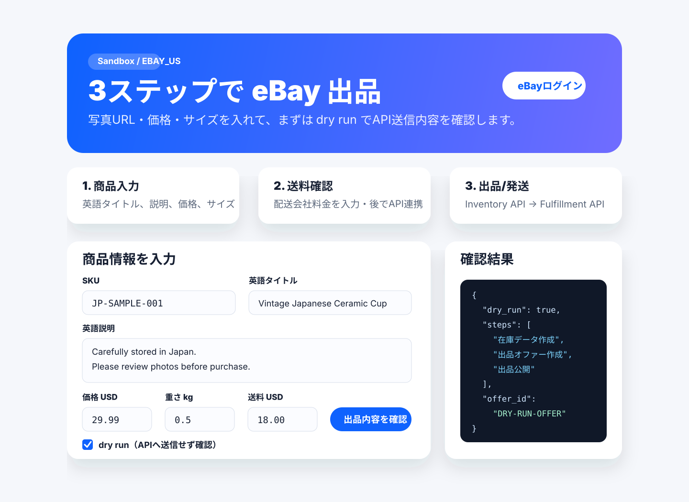

# UIサンプル画面

以下は、現在の `app/templates/index.html` と `app/static/style.css` をもとにしたサンプル画面です。実行環境に依存せず確認できるよう、SVG画像として保存しています。

## 画面の流れ

1. 右上の **eBayログイン** でOAuthログインします。
2. 商品名・説明・カテゴリID・価格・サイズ・送料を入力します。
3. 最初は **dry run** にチェックしたまま送信し、eBay APIへ送る予定のJSONを右側の確認結果で見ます。
4. Sandboxで問題がなければ、dry runを外して実際のAPIへ送信します。
